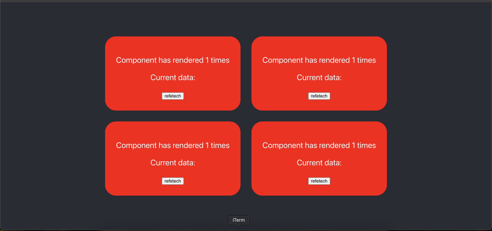
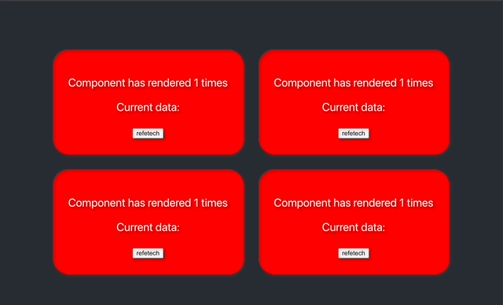
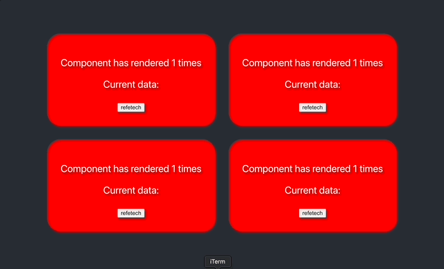
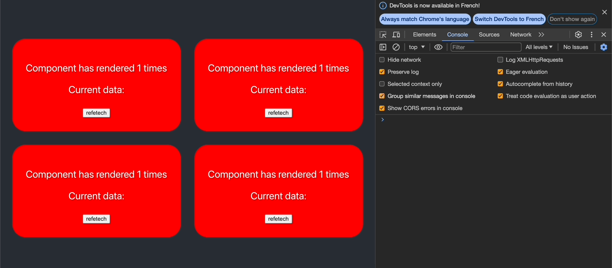
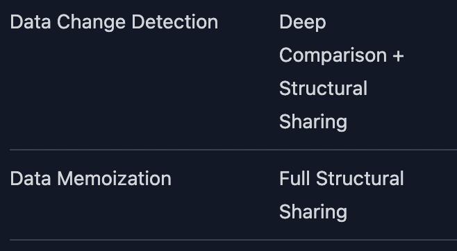

## Project Aim

This project walks through the process of optimizing a custom `useQuery` hook to efficiently manage state and re-renders, inspired by React Query's `useQuery` hook. The project is purely educational and not intended for production use (React Query's `useQuery` should be used instead).

## Project Setup

- **Framework:** This is a React project.
- **Starting the Project:** Run `yarn start` to start the project locally.

## How This Project is Organized

The application is a single page that includes four main components:

- **Component A (top left):** Uses React Query's `useQuery` to fetch data, accessing the `isFetching` and `data` fields to display a loader followed by the data.
- **Component B (top right):** Similar to Component A but only accesses `data` and displays it without a loader.
- **Component C (bottom left):** Uses a custom `useQuery` hook that mimics the behavior of Component A.
- **Component D (bottom right):** Uses a custom `useQuery` hook that mimics the behavior of Component B.

For each component, we display the number of renders, the data/loader, and a button to execute the query. All `useQuery` hooks use the same query function.

The project is divided into a series of commits, each representing a step toward optimizing our custom `useQuery` hook. These steps are documented in the "Step-by-Step Optimization Guide" section of this README.

## The Step-by-Step Optimization Guide

Here's a detailed breakdown of each step in optimizing our `useQuery` hook:

### Step 1: Initial Custom Hook Implementation

- **Description:** We start with a custom hook using a simple `useState`.
- **Observation:** The custom hook re-renders twice, even if the `isFetching` field isn't accessed (Component D), unlike React Query's `useQuery` which only re-renders once under similar conditions (Component B), as shown in the image below.
- **Commit Reference:** `0107bc81b72716fd9d345821e242b1b0eed8024a`

### Step 2: Introducing the Tracking Pattern

- **Description:** We address unnecessary re-renders by implementing a `useTrackedResult` hook for our custom `useQuery`. This hook uses JavaScript getters to monitor accessed fields (like `isFetching` or `data`) and only triggers re-renders when these tracked fields' values change, similar to React Query's [QueryObserver](https://github.com/TanStack/query/blob/c8442f8256aa37b479a45037a1681066f001496b/packages/query-core/src/queryObserver.ts#L253).
- **Commit Reference:** `b3813124eab25f484d212ad987342b2a3a330274`
- **Improvement:** This selective re-rendering enhances performance, aligning our hook more closely with React Query's efficient behavior.

### Step 3: Handling Non-Primitive Query Results

- **Description:** We modify the query to return an object instead of a primitive value. This change reveals a limitation: our custom hook re-renders even when the object's properties haven't changed, unlike `useQuery`.
- **Commit Reference:** `b531f4ebc59375f05396786339d4abece7fcaa93`
- **Solution:** The issue is due to shallow equality checks. To align with React Query, we implement deep equality checks using `lodash/isEqual` to accurately determine when to trigger re-renders.
- **Deep Equality Commit:** `65bee41bbf3c367fbb5cf9b294cf1d4205004819`

### Step 4: Ensuring Reference Stability

- **Description:** The final step involves adding a constant object field to the query's return value and monitoring changes to this field's reference with `useEffect`. Unlike React Query, which maintains reference stability, our custom hook triggers the `useEffect` callback with each update.
- **Commit Reference:** `65bee41bbf3c367fbb5cf9b294cf1d4205004819`
- **Conclusion:** This highlights the importance of structural sharing techniques, like those used by [React Query](https://github.com/TanStack/query/blob/68b5d792fa97e2c816124714ff0b057b2190555a/packages/query-core/src/utils.ts#L219), to prevent unnecessary re-renders. This technique was not added to our custom hook in this training.

At the end of this guide, you should have a deeper understanding of the cell in the [React Query comparison table](https://tanstack.com/query/v5/docs/framework/react/comparison):

